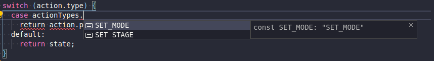
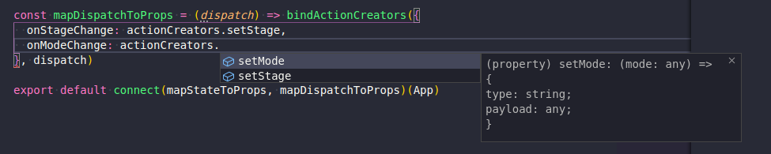

import { CodeWave } from "gatsby-theme-waves"

---

## Store

<CodeWave>


```jsx
const store = createStore(
  combineReducers(reducers),
  initialState,
);

export default store;
```


The raptor redux store contains only two middlewares:

```jsx
const store = createStore(
  combineReducers(reducers),
  initialState,
  composeWithDevTools(
    // other middleware here
  )
);

export default store;
```

  -  [Redux Devtools](https://github.com/zalmoxisus/redux-devtools-extension)


```jsx
const store = createStore(
  combineReducers(reducers),
  initialState,
  composeWithDevTools(
    applyMiddleware(
      ReduxThunk
    )
  )
);

export default store;
```

  -  And [Redux Thunk](https://github.com/reduxjs/redux-thunk)

```jsx
const store = createStore(
  combineReducers(reducers),
  initialState,
  composeWithDevTools(
    applyMiddleware(
      ReduxThunk.withExtraArgument(apiClient)
    )
  )
);

export default store;
```


Redux devtools middleware is called `withExtraArgument` passing our API client as param. This way, we can create an abstraction for the API call with authorization headers and any other stuff we might need (maybe `Content-Type: application/json` and `Accept: application/json`?).

The store is defined under `redux/store.js`.

</CodeWave>

## Action Types

All action types are defined on the `redux/actionTypes.js`. Please use the comments template to help organize better what each constant is for:

```js
// Stage --------------------------------
export const SET_STAGE = 'SET_STAGE'

// other file
import * as actionTypes from './actionTypes'
```

Named exports will allow us to use this syntax, and get intellisense for all available constants.


## Action Creators

<CodeWave>

```js
// Don't do this
import myAction from 'actionCreators/myaction'

// myAction :(
```

All action creators are defined by entity type, and imported into `redux/actionCreators/index.js` (using named exports).

```js
// Do this
// import myAction from 'actionCreators/myaction'
import * as actionCreators from 'actionCreators'

// myAction :(
// actionCreators.myAction :D
```

This way, VSCode can offer us intellisense for all our actions, by just opening `actionCreators/index.js` (so it can figure out all the imported function names)

</CodeWave>



## Reducers

<CodeWave>

```js
// Don't do this


export default (state = true, action) => {
  switch (action.type) {
    // ...
  }
};
```

All reducers are also defined by entity and imported on the `redux/reducers/index.js` file.

```js 
// Do this
import initialState from './initialState';

export const mode = (state = initialState.mode, action) => {
  switch (action.type) {
    // ...
  }
};
```

There's a `initialState.js` file under the same directory, where we'll want to store just that. We can reference that initialState by just following this pattern:

</CodeWave>

> **Important**: In case we need to add a new reducers, please update the `redux/reducers/index.js` AND the `redux/reducers/initialState.js`.
> This will help us write tests by just overriding the state that we want to test, without having to look after things that we didn't worked on. I'll talk about that under the *"Writing Tests"* section

## Writing tests

### Integration

If we keep the `initialState.js` file updated, and take the `ReduxThunk.withExtraArgument` approach, we'll be able to not only unit-test components. But also integration-test containers instead.

Let's say that we'd want to test a redux-connected container, that when we click a button it dispatches an async action and then increases a counter in the store.

```jsx
class CounterContainer extends React.Component {
  render () {
    const { increaseCount, count } = this.props;
    return <button
      data-test-id="counter-button"
      onClick={increaseCount}
    >
      {count}
    </button>
  }
}

export default connect(mapStateToProps, mapDispatchToProps)(CounterContainer)
```

<CodeWave>

```jsx
import CounterContainer from './CounterContainer';
import { shallow } from 'enzyme';

describe('CounterContainer', () => {
  let component = shallow(
    <CounterContainer />,
  )
});
```

Here we have our regular test setup

```jsx
import CounterContainer from './CounterContainer';
import { mount } from 'enzyme';

describe('CounterContainer', () => {
  let component = mount(
    <CounterContainer />,
  )
});
```

What we can do to test this case, is define our custom store, just mock and resolve the request promise, and make sure the `count` is updated. We'll use `mount` for that.

```jsx
import CounterContainer from './CounterContainer';
import { mount } from 'enzyme';

describe('CounterContainer', () => {
  let component = mount(
    <CounterContainer />,
    {
      wrappingComponent: ({children}) => (
        <Provider store={null}>
          {children}
        </Provider>
    }
  )
});
```

We create our custom wrapper component with the redux store provider.

```jsx
import CounterContainer from './CounterContainer';
import createTestStore from 'test/reduxUtils/testStore';
import { mount } from 'enzyme';

describe('CounterContainer', () => {
  let component = mount(
    <CounterContainer />,
    {
      wrappingComponent: ({children}) => (
        <Provider store={createTestStore()}>
          {children}
        </Provider>
    }
  )
});
```

We can make use of the `createTestStore` utility

```jsx
import CounterContainer from './CounterContainer';
import createTestStore from 'test/reduxUtils/testStore';
import { mount } from 'enzyme';

describe('CounterContainer', () => {
  let component = mount(
    <CounterContainer />,
    {
      wrappingComponent: ({children}) => (
        <Provider store={createTestStore({ count: 0 })}>
          {children}
        </Provider>
    }
  )
});
```

We can pass it the initial store state that will get merged with the real store initial state

```jsx
import CounterContainer from './CounterContainer';
import createTestStore from 'test/reduxUtils/testStore';
import { mount } from 'enzyme';

describe('CounterContainer', () => {
  let api = { post: spy().resolves(true) };
  let component = mount(
    <CounterContainer />,
    {
      wrappingComponent: ({children}) => (
        <Provider store={createTestStore({ count: 0 }, api)}>
          {children}
        </Provider>
    }
  )
});
```

And finally pass an api client mock as second argument

</CodeWave>

Now, if our action and reducer looks like this:

```js
// action (just an example)
export const increaseCount = () => (dispatch, getState, api) => {
  dispatch({ type: 'INCREASE_COUNTER @ REQUEST_INIT' });
  api
    .post('http://someurl.com')
    .then(() => {
       dispatch({ 'INCREASE_COUNTER @ REQUEST_SUCCESS' })
    });
}

// reducer
export const counter = (state = initialState.counter, action) => {
  switch (action.type) {
    case 'INCREASE_COUNTER @ REQUEST_SUCCESS':
      return state + 1;
    default:
      return state;
  }
}
```

Then we can just test if the number reflected by the component increased, since we are not mocking our reducer nor our action.

<CodeWave>

```js
import CounterContainer from './CounterContainer';
import createTestStore from 'test/reduxUtils/testStore';
import { mount } from 'enzyme';

describe('CounterContainer', () => {
  let api = { post: spy().resolves(true) };
  let component = mount(
    <CounterContainer />,
    {
      wrappingComponent: ({children}) => (
        <Provider store={createTestStore({ count: 0 }, api)}>
          {children}
        </Provider>
    }
  )

  it('The counter button has 0 by default', () => {
    expect(component.find({ 'data-test-id': 'counter-button' }).text()).to.equal("0")
  });
});
```

We make sure the component is getting the correct prop form the store

```js
import CounterContainer from './CounterContainer';
import createTestStore from 'test/reduxUtils/testStore';
import { mount } from 'enzyme';

describe('CounterContainer', () => {
  let api = { post: spy().resolves(true) };
  let component = mount(
    <CounterContainer />,
    {
      wrappingComponent: ({children}) => (
        <Provider store={createTestStore({ count: 0 }, api)}>
          {children}
        </Provider>
    }
  )
  it('The counter button has 0 by default', () => {
    expect(component.find({ 'data-test-id': 'counter-button' }).text()).to.equal("0")
  });

  describe('When the user clicks on the button', () => {
    before(() => {
      component.find({ 'data-test-id': 'counter-button' }).simulate('click');
    });
  });
});
```

We trigger the action that will make a change on our redux store

```js
import CounterContainer from './CounterContainer';
import createTestStore from 'test/reduxUtils/testStore';
import { mount } from 'enzyme';

describe('CounterContainer', () => {
  let api = { post: spy().resolves(true) };
  let component = mount(
    <CounterContainer />,
    {
      wrappingComponent: ({children}) => (
        <Provider store={createTestStore({ count: 0 }, api)}>
          {children}
        </Provider>
    }
  )
  it('The counter button has 0 by default', () => {
    expect(component.find({ 'data-test-id': 'counter-button' }).text()).to.equal("0")
  });

  describe('When the user clicks on the button', () => {
    before(() => {
      component.find({ 'data-test-id': 'counter-button' }).simulate('click');
    });

    it('sends a POST request to `http://someurl.com`', () => {
      expect(api.post.withArgs('http://someurl.com').calledOnce).to.be.true
    });
  });
});
```

We make assertions on the side effects from the actions

```js
import CounterContainer from './CounterContainer';
import createTestStore from 'test/reduxUtils/testStore';
import { mount } from 'enzyme';

describe('CounterContainer', () => {
  let api = { post: spy().resolves(true) };
  let component = mount(
    <CounterContainer />,
    {
      wrappingComponent: ({children}) => (
        <Provider store={createTestStore({ count: 0 }, api)}>
          {children}
        </Provider>
    }
  )
  it('The counter button has 0 by default', () => {
    expect(component.find({ 'data-test-id': 'counter-button' }).text()).to.equal("0")
  });

  describe('When the user clicks on the button', () => {
    before(() => {
      component.find({ 'data-test-id': 'counter-button' }).simulate('click');
    });

    it('sends a POST request to `http://someurl.com`', () => {
      expect(api.post.withArgs('http://someurl.com').calledOnce).to.be.true
    });

    it('increases the count when succesful', () => {
      component.update();
      expect(component.find({ 'data-test-id': 'counter-button' }).text()).to.equal("1")
    });
  });
});
```

And make sure the component is now reading the correct state.

(To manually trigger the resolve/reject of the action, please read the unit-test example provided below)

</CodeWave>

> Keep in mind that using enzyme's `mount` will render all the children components, and they might dispatch actions and call APIs. So we might want to create a base API client mock like this to prevent breaking other components. Please be careful with the container's children.
> 
> ```js
> const apiClientMock = {
>   'get': spy().resolves(true),
>   'post': spy().resolves(true),
>   'put': spy().resolves(true),
>   'patch': spy().resolves(true),
>   'delete': spy().resolves(true)
> }
> ```

### Writing Unit Tests

Keeping up with our previous example, if we only want to unit-test components and our redux state, we can do it as we always did, with the exception of action creators, which are a little bit different in this case.

<CodeWave>

```js
// actionCreators/counter.test.js

describe('counter action', () => {
  const reduxParams = {
    dispatch,
    getState,
    api,
  }
})
```

We define our redux thunk params first (since action creators are now a HOF).

```js
// actionCreators/counter.test.js

import { spy } from 'sinon'
import * as actionCreators from '../actionCreators'

describe('counter action', () => {
  const reduxParams = {
    dispatch: spy(),
    getState: () => ({ counter: 0 }),
    api: {
      post: () => {} // we'll call this later
    }
  }
  actionCreators.increaseCount()(...Object.values(reduxParams))
})
```

We define the params that our action is going to need, and then fire it.

```js
// actionCreators/counter.test.js

import { spy } from 'sinon'
import * as actionCreators from '../actionCreators'

describe('counter action', () => {
  const reduxParams = {
    dispatch: spy(),
    getState: () => ({ counter: 0 }),
    api: {
      post: () => {} // we'll call this later
    }
  }
  actionCreators.increaseCount()(...Object.values(reduxParams))

  it('dispatches an "INCREASE_COUNTER @ REQUEST_INIT" action', () => {
    expect(
      reduxParams.dispatch
        .match({ type: 'INCREASE_COUNTER @ REQUEST_INIT' })
        .calledOnce
    )
  })
})
```

We make sure the initial dispatch is called.

```js
// actionCreators/counter.test.js

import { spy } from 'sinon'
import * as actionCreators from '../actionCreators'

describe('counter action', () => {
  let resolver;
  let rejecter;
  const reduxParams = {
    dispatch: spy(),
    getState: () => ({ counter: 0 }),
    api: {
      post: sinon.mock(() => new Promise((res, rej) => {
        resolver = res;
        rejecter = rej;
      }))
    }
  }
  actionCreators.increaseCount()(...Object.values(reduxParams))

  it('dispatches an "INCREASE_COUNTER @ REQUEST_INIT" action', () => {
    expect(
      reduxParams.dispatch
        .match({ type: 'INCREASE_COUNTER @ REQUEST_INIT' })
        .calledOnce
    )
  })
})
```

Now we make sure that our API client is called the correct url (and any request body params, whatsoever).

```js
// actionCreators/counter.test.js

import { spy } from 'sinon'
import * as actionCreators from '../actionCreators'

describe('counter action', () => {
  let resolver;
  let rejecter;
  const reduxParams = {
    dispatch: spy(),
    getState: () => ({ counter: 0 }),
    api: {
      post: sinon.mock(() => new Promise((res, rej) => {
        resolver = res;
        rejecter = rej;
      }))
    }
  }
  actionCreators.increaseCount()(...Object.values(reduxParams))

  it('dispatches an "INCREASE_COUNTER @ REQUEST_INIT" action', () => {
    expect(
      reduxParams.dispatch
        .match({ type: 'INCREASE_COUNTER @ REQUEST_INIT' })
        .calledOnce
    )
  })

  it('sends a POST request to http://someurl.com', () => {
    expect(
      reduxParams.api
        .post
        .withArgs('http://someurl.com')
        .calledOnce
    ).to.be.true
  })
})
```

Now we can make sure the API client was called with the correct request URL.

```js
// actionCreators/counter.test.js

import { spy } from 'sinon'
import * as actionCreators from '../actionCreators'

describe('counter action', () => {
  let resolver;
  let rejecter;
  const reduxParams = {
    dispatch: spy(),
    getState: () => ({ counter: 0 }),
    api: {
      post: sinon.mock(() => new Promise((res, rej) => {
        resolver = res;
        rejecter = rej;
      }))
    }
  }
  actionCreators.increaseCount()(...Object.values(reduxParams))

  it('dispatches an "INCREASE_COUNTER @ REQUEST_INIT" action', () => {
    expect(
      reduxParams.dispatch
        .match({ type: 'INCREASE_COUNTER @ REQUEST_INIT' })
        .calledOnce
    )
  })

  it('sends a POST request to http://someurl.com', () => {
    expect(
      reduxParams.api
        .post
        .withArgs('http://someurl.com')
        .calledOnce
    ).to.be.true
  })

  it('dispatches an "INCREASE_COUNTER @ REQUEST_SUCCESS" action when resolved', () => {
    resolver(true); // resolve the promise
    expect(
      reduxParams.dispatch
        .match({ type: 'INCREASE_COUNTER @ REQUEST_SUCCESS' })
        .calledOnce
    ).to.be.true
  })
})
```

Finally we resolve the promise and make sure that the final action is dispatched as well.

</CodeWave>

